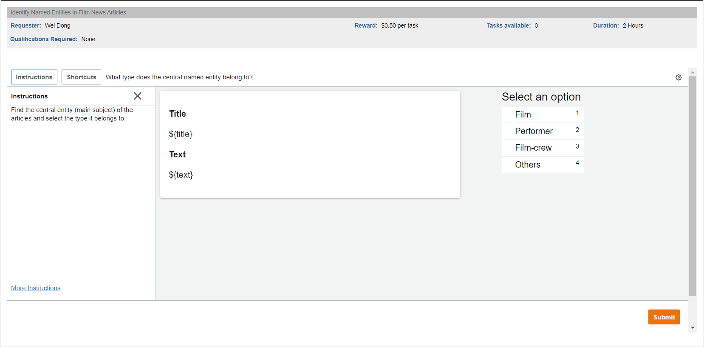
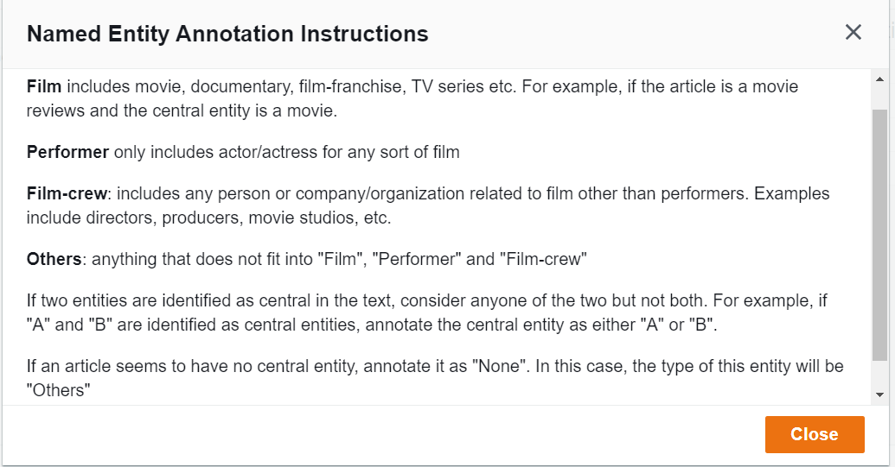

# Task Information
Title: Identify Named Entities in Film News Articles  
Description: Identify the central named entity and its category in film news Articles from The Guardian.  
Keywords: entertainment, film, movie, NER, classification

# Annotation Page

# Instructions

# Design Layout File
[design layout](design_layout.html)

# Sample Input to Mechanical Turk
[mturk_sample](mturk_sample.csv)