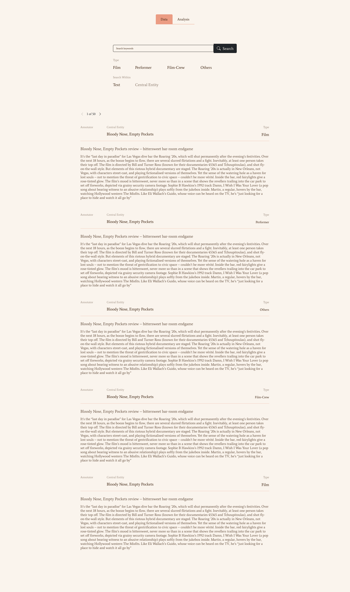
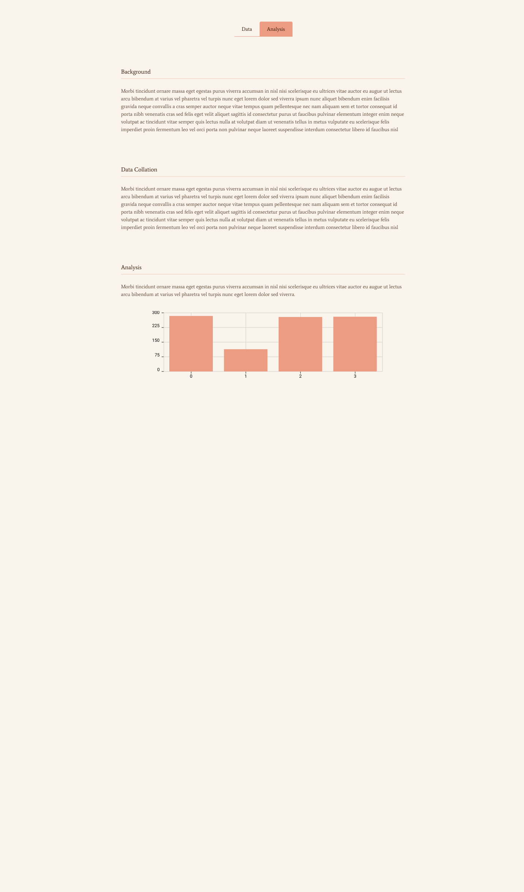

The web interface consists of two panes: a data page that allows the user to search and view original news articles and annotations, and an analysis page that explains the dataset and annotations.

## Data

The page consists of two parts: a search section and annotated data.
For each document, there are two annotations: the central entity of the text and the type of the central entities. The keyword search function will be able to only search for the central entities or the entire text along with the titles. The user can also specify the types to include. The search results are displayed in a format similar to blog posts because the news articles are below 500 words and but to long to display as a table along with the annotated information. If two annotators have different annotations, both will be displayed.

## Analysis

This page includes the background of the corpus, how the data is collected and annotated, and analysis with annotation distribution as well as interannotator agreement study.